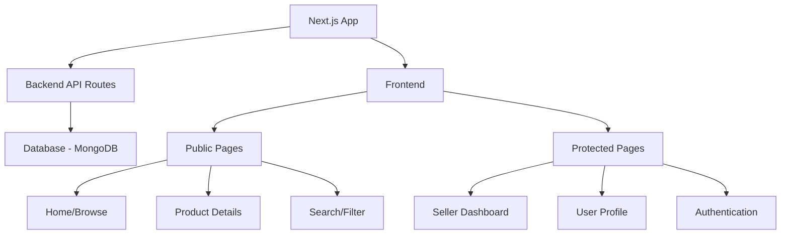
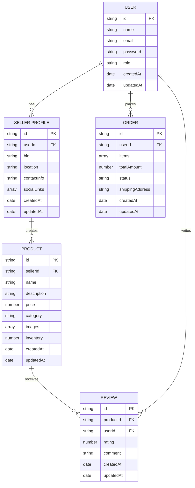

# Handcrafted Haven

## Overview

Handcrafted Haven is an innovative web application that provides a platform for artisans and crafters to showcase and sell their unique handcrafted items. It serves as a virtual marketplace, connecting talented creators with potential customers who appreciate the beauty and quality of handmade products. The application focuses on fostering a sense of community, supporting local artisans, and promoting sustainable consumption.

## Team Member

- **Steven M. Tan**

## Purpose of the Project

The purpose of this project is to help artisans list and sell their handcrafted products in their local community. This will give an opportunity for the artisans to showcase their works and to build a community where customers and artisans interact, share feedback, and collaborate.

## Project Architecture



## Technology Stack

### Frontend

- **Next.js** - React framework for building the user interface
- **TypeScript** - For type safety and improved developer experience
- **Tailwind CSS** - For responsive and customizable styling
- **React Hook Form** - For efficient form handling and validation
- **SWR** - For data fetching, caching, and state management

### Backend

- **Next.js API Routes** - For serverless API endpoints
- **NextAuth.js** - For authentication and session management
- **MongoDB** - NoSQL database for storing user data, product information, and orders
- **Mongoose** - ODM for MongoDB schema definition and validation
- **Cloudinary** - For image storage and optimization

### DevOps & Deployment

- **Git & GitHub** - For version control and collaboration
- **GitHub Projects** - For project management and task tracking
- **Vercel** - For continuous deployment and hosting

## Database Schema Design



## Key Features Implementation

### 1. Authentication System

- User registration and login
- Role-based access control (buyer, seller, admin)
- Secure password handling
- Social login options (Google, Facebook)
- Protected routes for authenticated users

### 2. Seller Profiles

- Detailed profile creation and management
- Portfolio display with images
- Bio and story section
- Contact information and social media links
- Rating and review aggregation

### 3. Product Management

- Product creation, editing, and deletion
- Multiple image upload and management
- Detailed product descriptions
- Pricing and inventory tracking
- Category and tag assignment

### 4. Product Discovery

- Advanced search functionality
- Filtering by category, price range, location
- Sorting options (newest, popular, price)
- Featured products section
- Related products suggestions

### 5. Reviews and Ratings

- Star rating system (1-5 stars)
- Written review submission
- Helpful/Not helpful voting on reviews
- Review moderation for inappropriate content
- Seller response to reviews

### 6. Shopping Cart and Checkout

- Add to cart functionality
- Cart management (update quantity, remove items)
- Order summary
- Shipping information collection
- Order confirmation and tracking

### 7. Responsive UI/UX

- Mobile-first design approach
- Accessible components (WCAG 2.1 AA compliant)
- Consistent branding elements
- Intuitive navigation
- Performance optimization

## Project Structure

```
handcrafted-haven/
├── public/                  # Static files
│   ├── images/              # Static images
│   └── favicon.ico          # Site favicon
├── src/                     # Source code
│   ├── app/                 # Next.js App Router
│   │   ├── api/             # API routes
│   │   │   ├── auth/        # Authentication endpoints
│   │   │   ├── products/    # Product endpoints
│   │   │   ├── users/       # User endpoints
│   │   │   └── orders/      # Order endpoints
│   │   ├── (auth)/          # Authentication pages
│   │   │   ├── login/       # Login page
│   │   │   └── register/    # Registration page
│   │   ├── dashboard/       # Dashboard pages
│   │   │   ├── seller/      # Seller dashboard
│   │   │   └── admin/       # Admin dashboard
│   │   ├── products/        # Product pages
│   │   │   ├── [id]/        # Product detail page
│   │   │   └── category/    # Category pages
│   │   ├── cart/            # Shopping cart page
│   │   ├── checkout/        # Checkout page
│   │   ├── profile/         # User profile page
│   │   └── page.tsx         # Home page
│   ├── components/          # Reusable components
│   │   ├── ui/              # UI components
│   │   ├── layout/          # Layout components
│   │   ├── forms/           # Form components
│   │   └── product/         # Product components
│   ├── lib/                 # Utility functions
│   │   ├── db/              # Database utilities
│   │   ├── auth/            # Authentication utilities
│   │   └── api/             # API utilities
│   ├── models/              # Database models
│   │   ├── User.ts          # User model
│   │   ├── Product.ts       # Product model
│   │   ├── Review.ts        # Review model
│   │   └── Order.ts         # Order model
│   ├── hooks/               # Custom React hooks
│   ├── context/             # React context providers
│   ├── types/               # TypeScript type definitions
│   └── styles/              # Global styles
│       ├── globals.css      # Global CSS styles
│       ├── bootstrap.min.css # Bootstrap framework CSS
│       └── modal.css        # Modal component styles (imported in _app.tsx)
├── .env.local               # Environment variables
├── .gitignore               # Git ignore file
├── next.config.js           # Next.js configuration
├── package.json             # Project dependencies
├── tsconfig.json            # TypeScript configuration
└── README.md                # Project documentation
```

## Development Workflow

1. **Project Setup**

   - Initialize Next.js project with TypeScript
   - Set up Tailwind CSS and other dependencies
   - Configure ESLint and Prettier
   - Set up MongoDB connection

2. **Core Features Development**

   - Implement authentication system
   - Create database models and schemas
   - Develop API endpoints
   - Build reusable UI components

3. **Feature Implementation**

   - Seller profile management
   - Product listing and management
   - Search and filtering functionality
   - Reviews and ratings system
   - Shopping cart and checkout process

4. **Testing and Optimization**

   - Unit and integration testing
   - Performance optimization
   - Accessibility testing
   - Cross-browser compatibility testing

5. **Deployment**
   - Set up Vercel deployment
   - Configure environment variables
   - Set up continuous integration/deployment

## CSS Architecture

In this Next.js application, we follow the framework's best practices for CSS imports:

1. **Global CSS** - All global CSS files are imported only in the custom App component (`src/pages/_app.tsx`). This includes:

   - `bootstrap.min.css` - Bootstrap framework styles
   - `globals.css` - Application-wide styles
   - `modal.css` - Modal component styles

2. **Component-Level CSS** - For component-specific styling, we use CSS Modules (files with `.module.css` extension) which are imported directly in the component files.

This approach follows Next.js recommendations to avoid conflicts between global styles and ensures proper loading of CSS in both server-side rendering and client-side navigation.

## Project Limitations

1. **Scalability** – The final application may not handle a large number of users without further optimization.
2. **Payment Processing** – Might not be available to use payment integration API.
3. **Security Concerns** – The application might not be strongly secure.

## Getting Started

clone this repository

To run the development server:

```bash
cd handcrafted-haven
npm run dev
```

The application will be available at http://localhost:3000.
