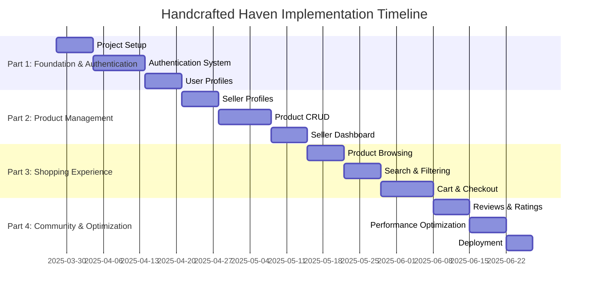

# Handcrafted Haven - Project Implementation Plan

This document outlines the implementation plan for the Handcrafted Haven e-commerce platform for artisans.

## Project Division

The project has been divided into four main parts to ensure a structured and efficient implementation process.

## Part 1: Foundation & Authentication

**Focus:** Project setup, core infrastructure, and user authentication

**Key Components:**

- Project structure and configuration
- Database connection setup
- Authentication system (registration, login, roles)
- User profile management
- Protected routes implementation

**Technical Elements:**

- Next.js app configuration
- MongoDB connection with Mongoose
- NextAuth.js implementation
- User model and API routes
- Basic layout components

**Deliverables:**

- Functional user registration and login
- Role-based access control (buyer, seller, admin)
- User profile pages
- Secure authentication flow

## Part 2: Product Management & Seller Dashboard

**Focus:** Seller functionality and product management

**Key Components:**

- Seller profile creation and management
- Product CRUD operations
- Image upload and management
- Seller dashboard
- Inventory management

**Technical Elements:**

- Seller profile model and API routes
- Product model and API routes
- Cloudinary integration for image storage
- Dashboard UI components
- Form handling with React Hook Form

**Deliverables:**

- Seller profile creation and editing
- Product listing creation, editing, and deletion
- Image upload functionality
- Seller dashboard with analytics
- Inventory management tools

## Part 3: Shopping Experience & Discovery

**Focus:** Customer-facing features and product discovery

**Key Components:**

- Home page and product browsing
- Search and filtering functionality
- Product detail pages
- Shopping cart
- Checkout process

**Technical Elements:**

- Search API implementation
- Filter components
- Product detail page
- Cart context and state management
- Checkout flow

**Deliverables:**

- Intuitive product browsing experience
- Advanced search and filtering
- Detailed product pages
- Shopping cart functionality
- Streamlined checkout process

## Part 4: Community & Optimization

**Focus:** Community features, reviews, and performance optimization

**Key Components:**

- Reviews and ratings system
- Order management
- Performance optimization
- Accessibility improvements
- Deployment and CI/CD

**Technical Elements:**

- Review model and API routes
- Order model and API routes
- Performance monitoring
- Accessibility testing
- Vercel deployment configuration

**Deliverables:**

- Review and rating functionality
- Order tracking and history
- Optimized performance metrics
- WCAG 2.1 AA compliance
- Production deployment with CI/CD

## Implementation Timeline

This division allows for a phased implementation approach:

## Development Approach

Each part builds upon the previous one, creating a logical progression from core functionality to more advanced features. This approach allows for testing and validation at each stage before moving on to the next set of features.

### Part 1 Implementation Details

1. **Project Setup**

   - Initialize Next.js with TypeScript
   - Configure ESLint and Prettier
   - Set up project structure
   - Install necessary dependencies

2. **Database Connection**

   - Set up MongoDB connection
   - Create database models for User
   - Implement database utility functions

3. **Authentication System**

   - Implement NextAuth.js
   - Create authentication API routes
   - Set up JWT handling
   - Implement role-based access control

4. **User Profile Management**
   - Create user profile pages
   - Implement profile editing functionality
   - Add avatar/image upload

### Part 2 Implementation Details

1. **Seller Profile Management**

   - Create seller profile model
   - Implement seller registration flow
   - Develop seller profile pages
   - Add seller settings and preferences

2. **Product Management**

   - Create product model
   - Implement product CRUD operations
   - Develop image upload functionality
   - Add product validation

3. **Seller Dashboard**
   - Create dashboard layout
   - Implement product management interface
   - Add analytics and reporting
   - Develop inventory management tools

### Part 3 Implementation Details

1. **Product Browsing**

   - Develop home page layout
   - Create product grid and list views
   - Implement category navigation
   - Add featured products section

2. **Search and Filtering**

   - Implement search functionality
   - Create filter components
   - Add sorting options
   - Develop pagination

3. **Shopping Experience**
   - Create product detail pages
   - Implement shopping cart functionality
   - Develop checkout process
   - Add order confirmation

### Part 4 Implementation Details

1. **Reviews and Ratings**

   - Create review model
   - Implement review submission
   - Add rating system
   - Develop review moderation tools

2. **Optimization**

   - Perform performance audits
   - Implement image optimization
   - Add caching strategies
   - Conduct accessibility testing

3. **Deployment**
   - Configure Vercel deployment
   - Set up CI/CD pipeline
   - Implement environment variables
   - Conduct final testing

## Success Criteria

The project will be considered successful when:

1. Artisans can create accounts, set up profiles, and list their products
2. Customers can browse, search, and purchase handcrafted items
3. The platform supports reviews and ratings for products
4. The application is responsive, accessible, and performs well
5. The system is deployed and available online

## Next Steps

The immediate next steps are to:

1. Complete the project setup
2. Establish the database connection
3. Implement the authentication system
4. Begin developing the user profile management features
